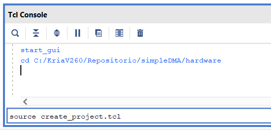
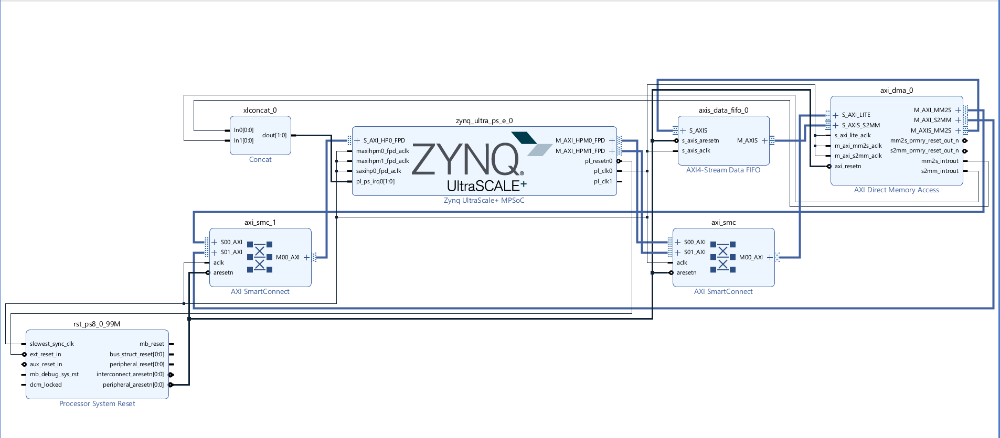
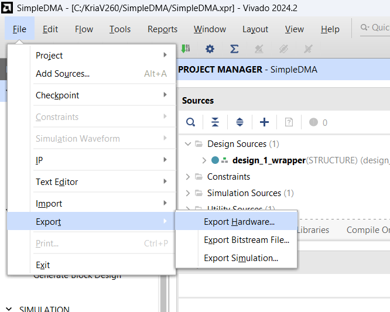
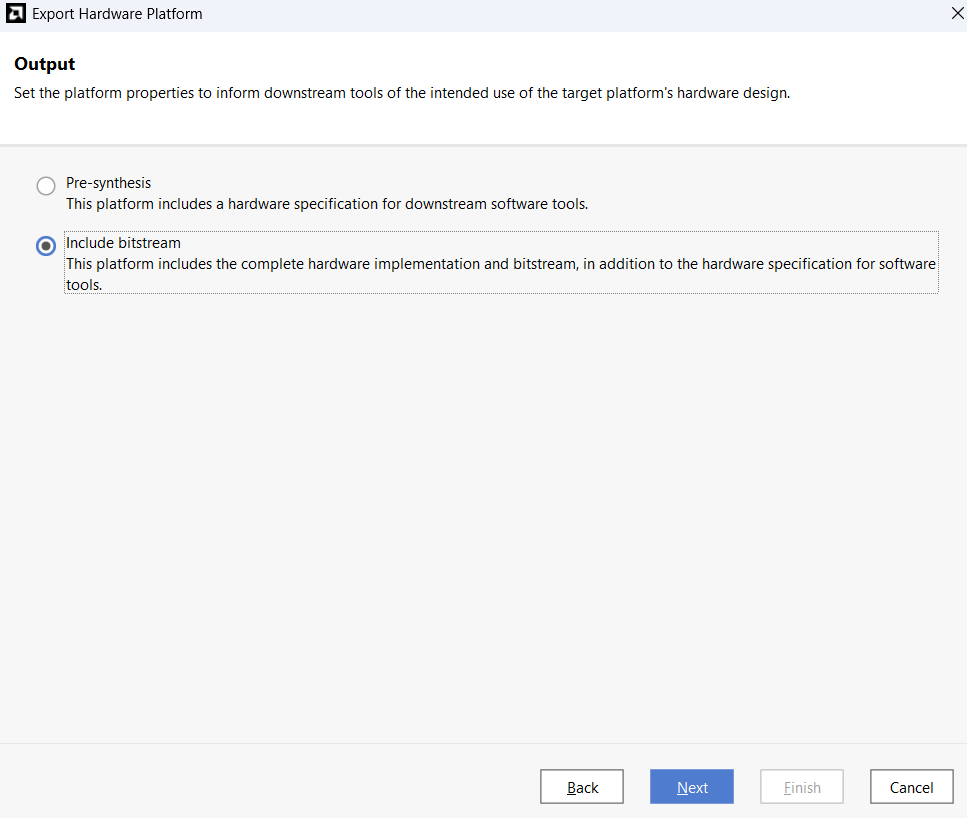

# 🛠️ Kria KV260 - Hardware Design (Vivado)

This directory contains the TCL scripts necessary to rebuild the Vivado hardware project from scratch.

The design features an **AXI DMA** specifically configured for **64-bit addressing**. This enables the FPGA to access the full High DDR memory range (starting at address 32GB+) on the Kria KV260, which is vital for running under Linux.

## 📋 Requirements

* **Vivado Design Suite** (Version 2024.2).
* **Vitis Unified Software Platform** (Version 2024.2) - Required if using XSCT.
* **Kria KV260 board files** installed in Vivado.

## 🚀 How to Rebuild the Project

You do not need to open an existing project file or worry about missing absolute paths. Follow these steps to generate a clean project structure automatically:

1.  Open **Vivado 2024.2** (just the welcome screen, do not open any project).
2.  Locate the **Tcl Console** at the bottom of the window.
3.  Navigate to this `hardware/` directory using the `cd` command in the Tcl console.
    * *Example:* `cd C:/Users/YourUser/Repo/Kria_DMA_Project/hardware`
4.  Execute the master script by running the following command:

```tcl
source create_project.tcl
```


## ⏳ What will happen?

Once the script runs, Vivado will perform the following actions automatically:

- Create a new project inside a subdirectory named `vivado_project/` (keeping the repo clean).
- Import the Block Design (`build_bd.tcl`) with all correct configurations (64-bit DMA, etc.).
- Generate the top-level HDL Wrapper.
- Leave the project open and ready for synthesis.



---

## 🔨 Next Steps: Generating Bitstream

Once the script finishes successfully and you see the block design on your screen:

1. In the left panel (**Flow Navigator**), click on **Generate Bitstream**.
2. This might take **15–30 minutes** depending on your PC.
3. When compilation finishes successfully, go to the top menu:

File > Export > Export Hardware




4. **Important:** Make sure to select **Include Bitstream** in the dialog box.
5. Save the resulting `.xsa` file (e.g., `kria_dma_64bit.xsa`) to a known location.

You will need this file later for the **PetaLinux / Yocto / XSCT workflow**.

---

## 🛠 Maintenance Note

If you modify the Block Design in the future (e.g., adding new IPs), remember to update the source script by running this command in the **Tcl Console** before committing to Git:

```tcl
write_bd_tcl -force ./build_bd.tcl
```


