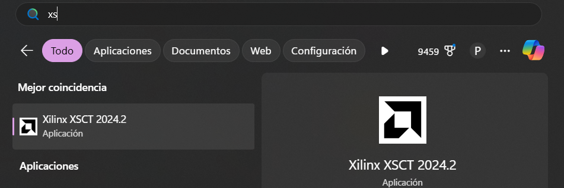
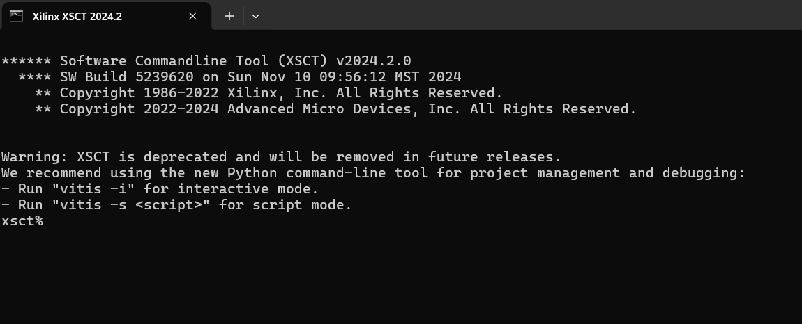
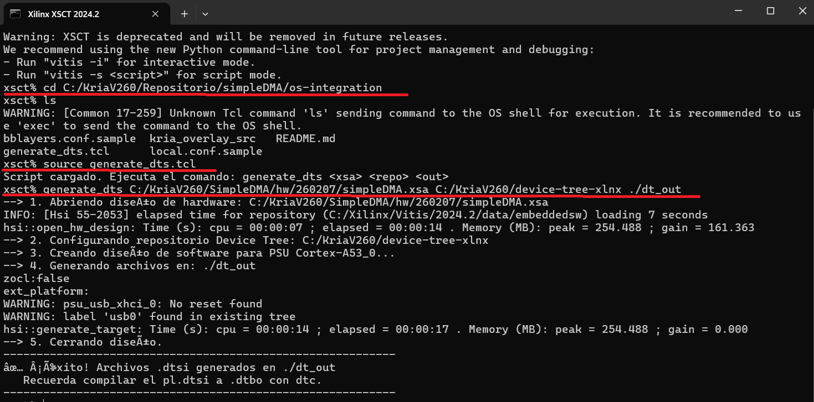

# 🐧 OS Integration & Firmware (Kria KV260)

This directory contains the necessary sources and scripts to generate the **Device Tree Overlay** and configure the **FPGA Manager (`xmutil`)**.

## 📂 File Structure

* **`kria_overlay_src/shell.json`**: The configuration file required by `xmutil`.
* **`generate_dts.tcl`**: A XSCT script to extract the PL Device Tree from your XSA file.

## 🛠️ Workflow: From Vivado to Kria

To load your hardware design on the Kria KV260 running Linux (Ubuntu/PetaLinux), follow these steps:

### 1. Generate the Device Tree Source (`.dtsi`)
You need the `device-tree-xlnx` repository and Xilinx XSCT (part of Vitis).

1. Clone the device tree repo (if you haven't):
   ```bash
   git clone https://github.com/Xilinx/device-tree-xlnx.git
    ```

### 2. Open XSCT 2024.2 Terminal

Launch the **XSCT 2024.2** terminal.



Once opened, you should see the XSCT command prompt:



---

### 3. Navigate to the OS Integration Directory

Change to the directory containing the Device Tree generation scripts:

```tcl
cd Path/os-integration
```

### 4. Load the Device Tree Generation Script

Source the TCL script that defines the Device Tree generation function

```tcl
source generate_dts.tcl
```

### 5. Execute the Device Tree Generation Function
Use the following syntax:

```tcl
generate_dts <xsa_path> <repo_path> <output_dir>
```

#### Example

```tcl
generate_dts ../deploy/kria_dma_64bit.xsa C:/Path/to/device-tree-xlnx ./dts_output
```

This command will:

* Parse the hardware design from the .xsa

* Use the device-tree-xlnx repository

* Generate the Device Tree sources in the specified output directory




## ⚙️ 6. Build the Device Tree Overlay (.dtbo)

Once you have the raw `pl.dtsi` generated by XSCT, we need to convert it into a valid Linux Overlay.

This process involves:
1.  **Cleaning:** Removing the `amba_pl` hierarchy to attach the DMA directly to `/axi`.
2.  **Wrapping:** Adding the required `fragment@0` (FPGA Region) and `fragment@1` (AXI Bus).
3.  **Compiling:** Converting the text (`.dts`) to binary (`.dtbo`).

### Step A: Generate the Final `.dts`
Use the provided Python script to process the raw file.

* **Syntax:** `python3 gen_dt_overlay.py <input.dtsi> <firmware_name.bin> <output.dts>`

Run this command inside the `os-integration/` folder:

```bash
# Example:
python3 gen_dt_overlay.py dts_output/pl.dtsi kria_dma.bin kria_dma.dts
```

Note: The firmware_name.bin argument must match the name of the bitstream file you will copy to the board later.

### Step B: Compile to Binary (`.dtbo`)

You need the Device Tree Compiler (`dtc`). (On Ubuntu: `sudo apt install device-tree-compiler`).

Compile the generated `.dts`:
```bash
dtc -@ -O dtb -o kria_dma.dtbo kria_dma.dts
```

* Flag `-@`: Crucial. It preserves symbols so the overlay can resolve references at runtime.

* Ignore warnings about "reg property" or "unit address" if they appear; they are usually harmless for overlays.

## 7 Deployment on Kria KV260

To load the hardware, you need 3 specific files. Ensure the names match exactly (.bin and .dtbo)

| File            | Source                         | Description                               |
|-----------------|--------------------------------|-------------------------------------------|
| `kria_dma.bin`  | From Vivado (`.bit` → `.bin`)  | FPGA bitstream                             |
| `kria_dma.dtbo` | From Step 6B                   | Device Tree overlay                       |
| `shell.json`    | From `kria_overlay_src/`       | Configuration file for `xmutil`            |

> 📝 **Note**

You can generate the FPGA bitstream in `.bin` format in two ways:

### Option 1: Simple Rename
You may directly rename your generated bitstream:
```text
kria_dma.bit → kria_dma.bin
```
⚠️ This works because the Kria boot flow accepts raw bitstreams in .bin format.

### Option 2: Convert .bit to .bin Using XSCT (Recommended)
or a cleaner and reproducible workflow, use bootgen from the XSCT terminal:
```xsct
exec bootgen -image bitstream.bif -arch zynqmp -o kria_dma.bin -w
```
`bitstream.bif` Example

The bitstream.bif file only needs the following content:
```bif
all:
{
    kria_dma.bit
}
```

### Step A: Transfer to the Board

Use SCP to copy the files to your Kria (put the 3 files in the same folder `kria_overlay_src` ):
```bash
cd kria_overlay_src 
scp kria_dma.bin kria_dma.dtbo shell.json root@172.29.13.106:/home/root/
```
### Step B: Install the Firmware

On the Kria board terminal:

1. Create the firmware directory: The folder name (`kria-dma-app`) will be the name used to load the app later (you can't use names like kria_dma_app, xmutil don't accept `_` ).

```bash
sudo mkdir -p /lib/firmware/xilinx/kria-dma-app
```
2. Move the files:
```bash
sudo mv kria_dma.bin kria_dma.dtbo shell.json /lib/firmware/xilinx/kria-dma-app/
```

### Step C: Load the Application

Use the Xilinx FPGA Manager utility (`xmutil`).

1. Unload default apps:
```bash
sudo xmutil unloadapp
```
2. Verify your app is listed:
```bash
sudo xmutil listapps
```
You should see kria-dma-app in the list.

3. Load your custom hardware:
```bash
sudo xmutil loadapp kria-dma-app
```

### ✅ Verification

If the load is successful:

1. The fan might spin up (depending on logic).

2. Check the kernel log for DMA registration:

```bash
dmesg | grep dma
```

Expected output: `xilinx-vdma a0000000.dma: Xilinx AXI DMA Engine Driver Probed!!`


### 🧹 Maintenance
If you change the Block Design in Vivado:

1. Export new .xsa.

2. Run generate_dts.tcl (XSCT).

3. Run gen_dt_overlay.py (Python).

4. Run dtc.

5. Update files on the board.


