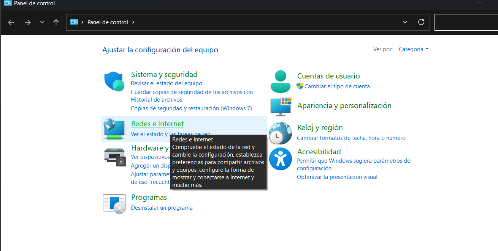
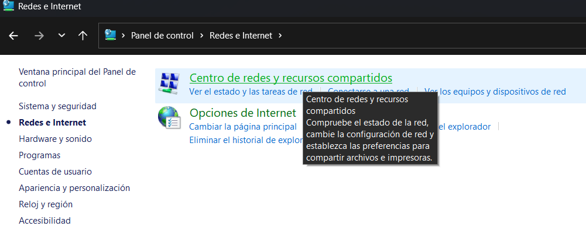
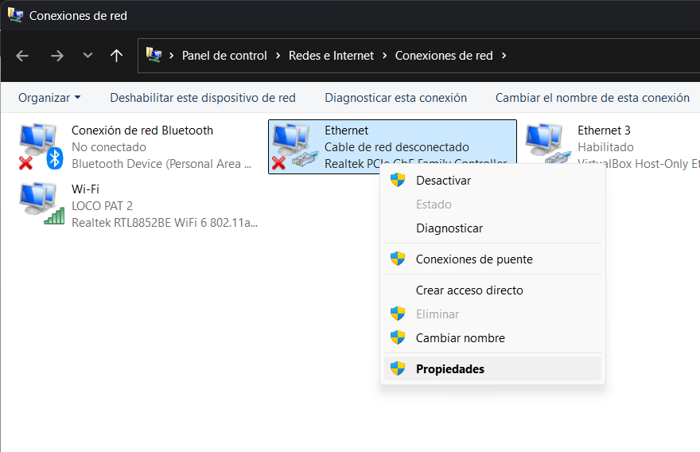
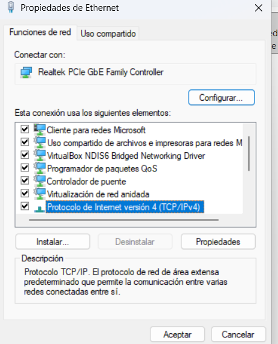
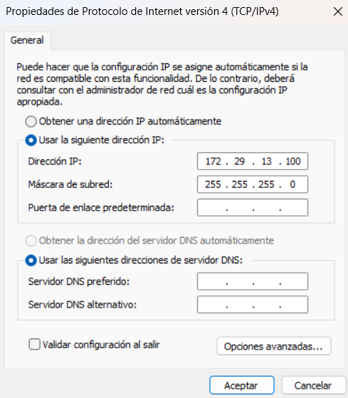
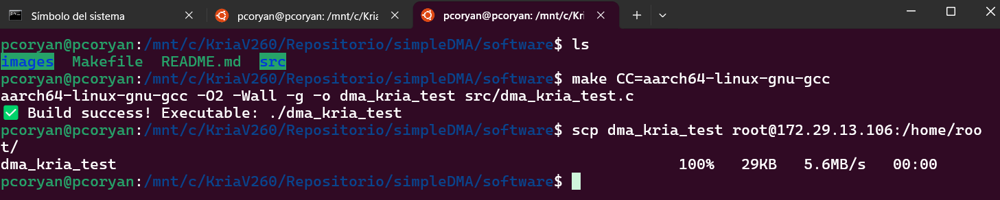
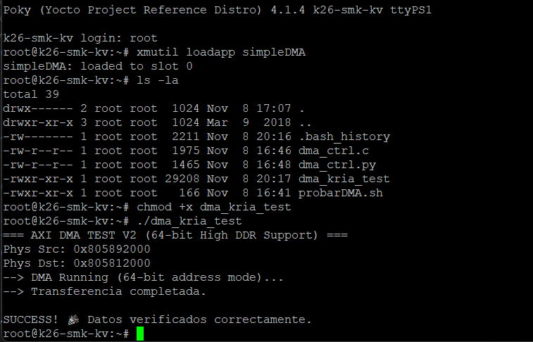

# 💻 Kria DMA Software (Userspace)

This directory contains the C application to benchmark and test the AXI DMA transfer from Linux Userspace.

It uses `/dev/mem` to map physical memory, bypassing the kernel cache (via `O_SYNC`) to ensure data coherency between the CPU and the FPGA.

## 📋 Prerequisites

* **GCC Compiler:** Must be installed on the Kria board (or cross-compiler on PC).
* **Root Privileges:** The application needs `sudo` to access `/dev/mem`.
* **FPGA Bitstream:** The `kria_dma_64bit.bin` must be loaded before running this software.

## 🚀 How to Compile

## Cross-Compile on PC

If you are compiling on your host PC for the **Kria (ARM64)**:

```bash
make CC=aarch64-linux-gnu-gcc
```

## 📡 Transferring Files to Kria Using SCP

### Step 1: Network Connection

Connect an **Ethernet cable** (1) from the **Kria board** to your PC or network interface.

- Make sure the correct network interface is selected on your host PC (e.g. `eth0`, `enp0s3`, etc.).
- Both devices must be on the **same network/subnet**.

<p align="center">
  
</p>

## 🧩 Step 2: Configure Your PC (Windows 11) to Be on the Same Network as Kria

To transfer files via SCP, your **Windows 11 PC** must be on the **same subnet** as the Kria board.

---

### 2.1 Open Network Settings

1. Open **Control Panel**.
   
   

2. Go to **Network and Sharing Center**.
   
   

3. Click on **Change adapter settings**.
   
   

---

### 2.2 Configure the Ethernet Interface

4. Right-click on the **correct network interface** (the one connected to Kria) and select **Properties**.
   
   

5. Select **Internet Protocol Version 4 (TCP/IPv4)** and click **Properties**.
   
   

---

### 2.3 Set a Static IP Address

In this example, the **Kria IP address** is:

172.29.13.106


Configure your PC with:
- An IP address **in the same subnet**
- A **different host number** to avoid conflicts

Example configuration:

- **IP address:** `172.29.13.100`
- **Subnet mask:** `255.255.255.0`
- **Default gateway:** *(leave empty or optional)*



> ⚠️ Important:  
> Do **not** use the same IP address as Kria. Only the **network portion** (`172.29.13.xxx`) must match.

---

Once this is done, your PC and Kria should be able to communicate directly over Ethernet.


## 🚚 Step 3: Transfer Files to Kria Using SCP

From your **host PC** (in this case, using **WSL2**), send the compiled binary to the Kria board using `scp`:

```bash
scp dma_kria_test root@172.29.13.106:/home/root/
```
## 🏃 How to Run

Once the transfer completes, you can log into Kria and run the application.

first ensure the bitstream is loaded (using xmutil or fpgautil). then:

Run the application with sudo:
```bash
chmod +x dma_kria_test
sudo ./dma_kria_test
```

# 🔁 Complete Workflow Overview

This section summarizes the **end-to-end flow** between the **PC Host** and the **Kria board**, from compilation to execution.

---

## 💻 PC Host (WSL2)

- Cross-compilation of the application
- File transfer via SCP to Kria

<p align="center">
  
</p>

---

## 🧠 Kria Board

- Bitstream loading
- Application execution

<p align="center">
  
</p>
