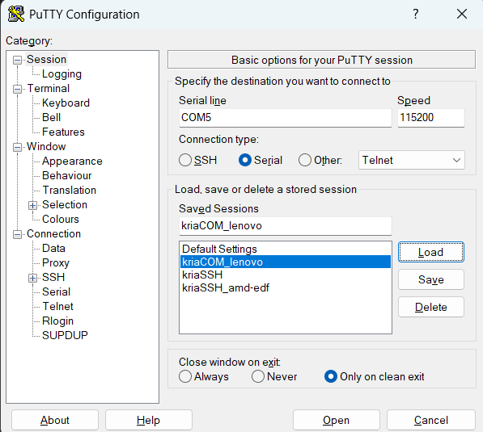
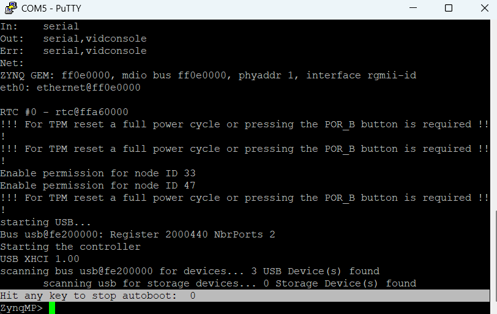
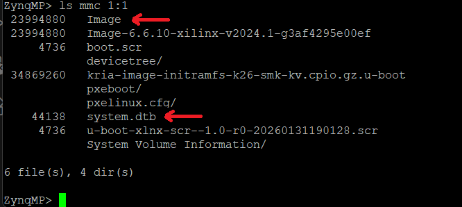

# 🐧 Kria KV260: Custom Yocto Linux Build

This document explains how to build a custom Yocto Linux image for the Kria KV260, optimized for DMA development, low latency, and FPGA integration.

* **Target board**: Kria KV260

* **Yocto release**: Scarthgap / Langdale (rel-v2024.1)

* **Recommended host**: Ubuntu 22.04 LTS (native or WSL2)


---

## 📋 1. Host Environment Preparation

### 1.1 Locale and Required Packages

On a clean Ubuntu 22.04 host, run:
```bash
sudo apt update && sudo apt upgrade -y

sudo apt install -y locales
sudo locale-gen en_US.UTF-8
sudo update-locale LANG=en_US.UTF-8
export LANG=en_US.UTF-8

sudo apt install -y gawk wget git diffstat unzip texinfo gcc build-essential \
     chrpath socat cpio python3 python3-pip python3-pexpect xz-utils \
     debianutils iputils-ping python3-git python3-jinja2 libegl1-mesa \
     libsdl1.2-dev pylint xterm zstd liblz4-tool make libtinfo5 \
     python3-subunit mesa-common-dev
```

### 1.2 Install the repo Tool

Yocto sources are managed using Google’s `repo` tool.

```bash
mkdir -p ~/bin
curl https://storage.googleapis.com/git-repo-downloads/repo > ~/bin/repo
chmod a+x ~/bin/repo
echo 'export PATH=~/bin:$PATH' >> ~/.bashrc
source ~/.bashrc

git config --global user.name "Your Name"
git config --global user.email "your@email.com"
```

## 📥 2. Download Yocto Sources

Use the official Xilinx Yocto manifests.

```bash
mkdir -p ~/kria-yocto-project
cd ~/kria-yocto-project

repo init -u https://github.com/Xilinx/yocto-manifests.git -b rel-v2024.1
repo sync
```

## ⚙️ 3. Build Configuration

### 3.1 Initialize the Yocto Environment

```bash
source sources/poky/oe-init-build-env build
```

### 3.2 Add Required Layers

```bash
# OpenEmbedded layers
bitbake-layers add-layer ../sources/meta-openembedded/meta-oe
bitbake-layers add-layer ../sources/meta-openembedded/meta-python
bitbake-layers add-layer ../sources/meta-openembedded/meta-networking
bitbake-layers add-layer ../sources/meta-openembedded/meta-filesystems

# Xilinx & Kria layers
bitbake-layers add-layer ../sources/meta-xilinx/meta-xilinx-core
bitbake-layers add-layer ../sources/meta-xilinx/meta-xilinx-bsp
bitbake-layers add-layer ../sources/meta-xilinx/meta-xilinx-standalone
bitbake-layers add-layer ../sources/meta-xilinx-tools
bitbake-layers add-layer ../sources/meta-kria

# Custom project layer
# (Copy meta-kria-custom from this repository into ../sources/)
bitbake-layers add-layer ../sources/meta-kria-custom
```

### 3.3 Edit conf/local.conf

Remove the default `MACHINE ??=` line and append:
```bash
# --- Kria KV260 ---
MACHINE ??= "k26-smk-kv"

# Systemd
DISTRO_FEATURES:append = " systemd virtualization"
VIRTUAL-RUNTIME_init_manager = "systemd"
DISTRO_FEATURES_BACKFILL_CONSIDERED = "sysvinit"

# Xilinx version alignment
XILINX_VER_MAIN = "2024.1"
XILINX_VER_UPDATE = "release"
XILINX_VER_BUILD = "v2024.1"

# Accept Xilinx licenses
LICENSE_FLAGS_ACCEPTED:append = " xilinx "

# Allow git versions of Kria tools
PREFERRED_VERSION_xmutil = "%"
```
## 🛠️ 4. ➕ Adding Fundamental System Features (Custom Yocto Layer)

This section explains how to extend the base Yocto image by creating a **custom layer**.  
This approach ensures that your changes are **isolated, reproducible, and safe** when upgrading Yocto in the future.

---

### 🧱 Step 1: Create and Register Your Custom Layer

We start by creating a **dedicated layer** for project-specific modifications.

Make sure you are inside the Yocto `build` directory:

```bash
cd ~/kria-yocto-project/build
```

Then run the following commands:

```bash
# 1. Create the new custom layer structure
bitbake-layers create-layer ../sources/meta-patrik

# 2. Register the layer in the Yocto configuration
bitbake-layers add-layer ../sources/meta-patrik
```
At this point, your custom layer is known by Yocto and ready to be used.

##### 📚 Verify Active Layers

To confirm your layer is registered and see layer priorities, run:

```
bitbake-layers show-layers
```

You should see meta-patrik listed near the end.

### 📁 Step 2: Create the Required Folder 

Yocto is very strict about directory layout.
To modify an existing image, we must mirror its original recipe path.

Create the directory structure for image extensions:

```bash
mkdir -p ../sources/meta-patrik/recipes-core/images/
```

### Step 3: Create the Image Extension (.bbappend)

Now we create a `.bbappend` file, which tells Yocto:

“Take `core-image-full-cmdline` and add these extra packages.”

#### 3.1 Create the File

```bash
nano ../sources/meta-patrik/recipes-core/images/core-image-full-cmdline.bbappend
```

#### 3.2 Paste the Following Content

```bash
# --- Patrik customizations for Kria ---

# 1. Core development tools and Python stack
IMAGE_INSTALL:append = " \
    python3 \
    python3-pip \
    python3-core \
    python3-numpy \
    git \
    nano \
    htop \
    util-linux \
"

# 2. Xilinx Kria-specific tools (Hardware & FPGA management)
IMAGE_INSTALL:append = " \
    xmutil \
    dfx-mgr \
    libdfx
    xrt \
"

# 3. Extra root filesystem space (recommended)
IMAGE_ROOTFS_EXTRA_SPACE = "524288"
```

#### 3.3 Save and Exit

Press `Ctrl + O` → Enter

Press `Ctrl + X`


### 🌐 step 4: Create the Static IP Recipe

#### 4.1 Create the Folder Structure

Inside your custom layer:
```
mkdir -p ../sources/meta-patrik/recipes-connectivity/static-ip/files
```

#### 4.2 Create the Network Configuration File

This file will be read by systemd-networkd.

```
nano ../sources/meta-patrik/recipes-connectivity/static-ip/files/10-eth0.network
```
Paste the following content
(adjust the IP and gateway to match your local network):

```bash
[Match]
Name=eth0

[Network]
# Static IP address
Address=172.29.13.106/24

# Default gateway (router)
Gateway=172.29.13.1

# DNS servers
DNS=8.8.8.8
DNS=1.1.1.1
```

Save with `Ctrl + O` → Enter, then `Ctrl + X`.

#### 4.3 Create the BitBake Recipe

This recipe tells Yocto to install the `.network` file into
`/etc/systemd/network/`.

```bash
nano ../sources/meta-patrik/recipes-connectivity/static-ip/static-ip-eth0.bb
```

Paste the following:

```bash
SUMMARY = "Static IP configuration for eth0"
LICENSE = "MIT"
LIC_FILES_CHKSUM = "file://${COMMON_LICENSE_DIR}/MIT;md5=0835ade698e0bcf8506ecda2f7b4f302"

SRC_URI = "file://10-eth0.network"

S = "${WORKDIR}"

do_install() {
    # Create destination directory
    install -d ${D}${sysconfdir}/systemd/network

    # Install network configuration file
    install -m 0644 ${WORKDIR}/10-eth0.network \
        ${D}${sysconfdir}/systemd/network/
}

FILES:${PN} += "${sysconfdir}/systemd/network/10-eth0.network"
```

Save and exit

### 5. Add the Static IP Recipe to the Image

Edit the image extension again:
```
nano ../sources/meta-patrik/recipes-core/images/core-image-full-cmdline.bbappend
```

Update it so it includes `static-ip-eth0`:

```bash
# --- Patrik customizations for Kria ---

# 1. Core development, networking, and Python tools
IMAGE_INSTALL:append = " \
    python3 \
    python3-pip \
    python3-core \
    python3-numpy \
    git \
    nano \
    htop \
    util-linux \
    static-ip-eth0 \
"

# 2. Xilinx Kria-specific tools
IMAGE_INSTALL:append = " \
    xmutil \
    dfx-mgr \
    libdfx \
    xrt \
"

# 3. Extra root filesystem space
IMAGE_ROOTFS_EXTRA_SPACE = "524288"
```
✅ Result

* After rebuilding the image:

* Python and common tools are available

* Kria FPGA management tools are installed

* The board boots with a static IP on eth0

* All changes live inside meta-patrik, keeping Yocto clean and upgrade-safe


## 🧱 5. Build the Image

### ⚠️ WSL2 users:
Synchronize the system clock before building:
```bash
sudo hwclock -s
```

Start the build:

```bash
bitbake core-image-full-cmdline
```
⏱ Build time: 2–6 hours depending on CPU and storage.


## ⚡ 6. Flashing the SD Card from WSL2 (USB Passthrough)

When using **WSL2**, USB devices (such as an SD card reader) are **not visible by default**.  
To enable access, follow the official Microsoft guide:

🔗 **USB support in WSL2**  
https://learn.microsoft.com/windows/wsl/connect-usb

Follow that guide to connect your **SD card reader** to Ubuntu running inside WSL2.

### 6.1 Locate the Yocto Imag

From your Yocto project directory (inside the `build/` folder), navigate to:

```bash
ls -lah build/tmp/deploy/images/k26-smk-kv-sdt/
```
In this directory, you should find the generated .wic image, which will be flashed to the SD card.

6.2 Identify the SD Card Device

Use lsblk to identify the correct device name for your SD card.

⚠️ Critical:

You must be 100% sure which device you are flashing.
Writing to the wrong device can permanently erase your system disk.

Recommended procedure:

1. Run lsblk before connecting the SD card reader:
```bash
lsblk
```

2. Connect the SD card reader to WSL2.
3. Run lsblk again:
```bash
lsblk
```
4. Identify the new device that appears (e.g. `sde`).

In this example:
* The SD card appears as `/dev/sde`
* Therefore, sdX = sde

Your device name may be different—always use the one that appears on your system.

### 6.3 Flash the SD Card

Use `dd` to write the Yocto image to the SD card:

```bash
sudo dd if=kria-image-full-cmdline-<version>.wic of=/dev/sdX bs=4M status=progress conv=fsync
sync
```

Replace:

* kria-image-full-cmdline-<version>.wic with the actual image filename

* /dev/sdX with the correct device (e.g. /dev/sde)

The sync command ensures all data is fully written before removing the SD card.

After flashing completes, safely remove the SD card and insert it into the Kria board.

## 🚀 Booting the Kria from SD Card (Manual Recovery & Permanent Fix)

Insert the **SD card** into the Kria board and power it on.

### Serial Console Setup

- Make sure the **USB-UART (COM port)** is connected so you can see the boot logs.
- A serial terminal is **required** to debug the boot process.

<p align="center">
  
</p>

**Recommended tool:** PuTTY  
- Select the **first COM port** that appears when you connect the Kria (e.g. `COM5`).
- **Baud rate:** `115200` (this is almost always correct for Kria).

Once connected, power on the board.

---

### Normal Boot Behavior

- In most cases, the system should **boot automatically** without any interaction.

---

### If the Board Does NOT Boot Automatically

Follow these steps to enter manual recovery mode:

1. Press the **RESET** button on the Kria board.
2. When the **autoboot countdown** appears (`2 → 0`), **press any key** to stop autoboot.

<p align="center">
  
</p>

> ⚠️ Timing is important — you must press a key **before the countdown reaches zero**.

3. If successful, you will see the U-Boot prompt:

```text
ZynqMP>
```
At this point, the board is ready for manual boot commands and recovery procedures.

## 💉 Manual Boot (Bypassing a Broken `boot.scr`)

If the SD card contains the correct files but the system does not boot automatically, we can **manually load and boot Linux** from U-Boot.  
This helps verify that the **kernel, device tree, and root filesystem are healthy**.

### Step 1: Load Kernel and Device Tree (Temporary Addresses)

Type the following commands **one by one** at the `ZynqMP>` prompt.

> ⚠️ Note: > Replace `system.dtb` if your Device Tree has a different filename (as seen in `ls mmc 1:1`).

<p align="center">
  
</p>

Linux must know:

* Which partition contains the root filesystem

* Which serial console to use

Without this, the kernel will boot but panic when mounting the root filesystem.

Set the boot arguments:
```bash
setenv bootargs 'console=ttyPS1,115200 root=/dev/mmcblk1p2 rw rootwait earlycon'
```
>📝 Note:
mmcblk1p2 is the second partition of the SD card, where Yocto installs the root filesystem.


```bash
# 1. Load the Linux kernel into RAM (address 0x00200000)
fatload mmc 1:1 0x00200000 Image

# 2. Load the Device Tree into RAM (address 0x00100000)
fatload mmc 1:1 0x00100000 system.dtb

# 3. Boot the kernel
booti 0x00200000 - 0x00100000
```
### ✅ Expected Result
* If booti succeeds, you will see Linux kernel logs scrolling.

* After a few seconds, you should reach the login prompt.

```bash
k26-smk-kv login:
```
If you reach the login prompt, the manual boot was successful 🎉, the login is root

💾 Step 2: Make the Boot Permanent (One-Time Setup)

Now that we know the correct commands, we can store them in U-Boot so the board boots automatically every time.

Procedure

1. From Linux, type:
```bash
reboot
```
(or power-cycle the board)

2. Stop autoboot again to return to:
```bash
ZynqMP>
```

3. Enter the following commands exactly, one by one:
```bash
# 1. Define kernel boot arguments
setenv bootargs 'console=ttyPS1,115200 root=/dev/mmcblk1p2 rw rootwait earlycon'

# 2. Define automatic boot command
setenv bootcmd 'fatload mmc 1:1 0x18000000 Image; fatload mmc 1:1 0x10000000 system.dtb; booti 0x18000000 - 0x10000000'

# 3. Save environment to persistent storage
saveenv

# 4. Reboot to test
reset
```

### ✅ Final Verification

This time, do not press any key.

The Kria should:

Kria should:

* Boot automatically
* Display kernel logs
* Stop at:
    ```
    k26-smk-kv login:
    ```
🎯 Your Kria is now permanently configured to boot your custom Yocto Linux image.


